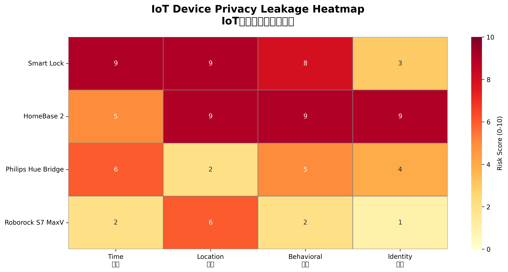
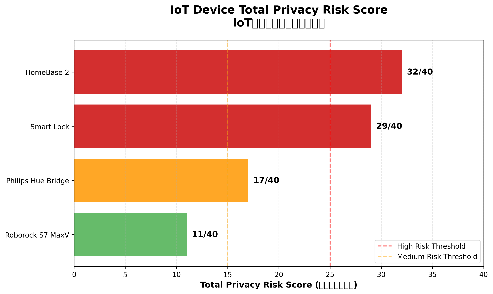
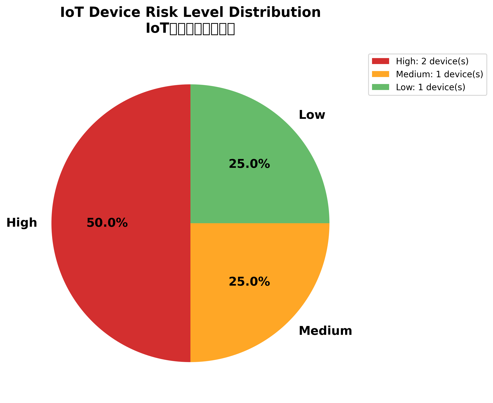

# IoT Privacy Leakage Analysis — Smart Home Traffic Study
 
> Empirical network analysis of four commercial smart home devices, quantifying what
> categories of sensitive personal information leak through routine IoT communications —
> and how sharply that risk varies by device category.
>
> Includes a **critical unauthenticated RTSP finding (CVSS 9.8)** discovered during
> hands-on validation.
 
**Tools:** Wireshark 4.6 · Nmap 7.98 · tcpdump · Python 3.12 (Scapy, Matplotlib) · LINDDUN · NIST Privacy Framework
 
---
 
## Overview
 
Smart home adoption is projected to exceed 400 million households, yet consumer IoT
devices routinely disclose far more than their marketing suggests — the 2022 Eufy
incident showed that even devices sold on an explicit privacy promise can leak
unencrypted streams and credentials.
 
This study captured and analysed live traffic from four devices on a residential
network across distinct functional categories — access control, surveillance, lighting,
and autonomous cleaning — scored each against a purpose-built four-dimensional privacy
risk matrix, then went further and **empirically validated the assumptions** through
active testing.
 
**Two headline outcomes:**
 
1. Security-focused devices leaked substantially more than utility devices —
   Eufy HomeBase 2 scored **32/40** against Roborock S7 MaxV at **11/40**.
2. Active validation uncovered a **critical vulnerability**: the HomeBase RTSP service
   accepts connections with **no authentication at all**.
---
 
## Critical Finding — Unauthenticated RTSP (CVSS 9.8)
 
The passive assessment flagged an open RTSP port on the surveillance hub as a
*potential* risk. Rather than leaving it as an assumption, I tested it directly:
 
```bash
curl -i rtsp://<HOMEBASE_IP>:554/
```
 
A secured RTSP server should respond `401 Unauthorized`. This device returned
`200 OK` and advertised its full method set — `OPTIONS, DESCRIBE, SETUP, TEARDOWN,
PLAY, GET_PARAMETER` — meaning any device on the local network can reach the
streaming interface without credentials.
 
**Full write-up, CVSS breakdown, impact analysis and applied mitigations:**
[`findings/homebase-rtsp-unauth.md`](findings/homebase-rtsp-unauth.md)
 
Tested on my own hardware, on my own network, reported to the vendor and mitigated.
 
---
 
## Research Question
 
> What categories of sensitive personal information are inadvertently disclosed through
> routine IoT device communications, and how do privacy risks vary across smart home
> device types?
 
**Hypothesis:** security-focused devices, because their operation requires processing
sensitive contextual data, exhibit significantly higher privacy leakage than
utility-oriented devices.
 
---
 
## Environment & Devices
 
Residential network behind a Netgear Orbi mesh system. Four devices selected to span
distinct operational categories:
 
| Device | Category | Rationale |
|---|---|---|
| Eufy Smart Lock | Access control | Security-critical; prior privacy controversy |
| Eufy HomeBase 2 (+3 cameras) | Surveillance hub | Aggregates multiple sensor streams |
| Philips Hue Bridge | Lighting control | Utility baseline |
| Roborock S7 MaxV | Autonomous cleaning | Utility baseline |
 
---
 
## Methodology
 
**Passive capture.** Wireshark 4.6 and tcpdump on the macOS WiFi interface (`en0`),
with per-device filtering to isolate each device's traffic, including a continuous
multi-hour monitoring run to capture background behaviour.
 
**Active reconnaissance.** Nmap 7.98 to enumerate open ports, running services and
misconfigurations on each device.
 
**Active validation.** Targeted protocol testing (curl, netcat) against exposed
services to confirm or refute the assumptions made during passive assessment.
 
**Privacy risk scoring.** A custom four-dimensional matrix drawing on the LINDDUN
privacy threat framework (Deng et al., 2011) and the NIST Privacy Framework. Each
dimension scored 0–10:
 
| Dimension | What it measures |
|---|---|
| Temporal | Usage patterns and event timing |
| Location | Geographic coordinates and device positioning |
| Behavioural | Inferable activity patterns and habits |
| Identity | Personal identifiers and authentication data |
 
Composite score (0–40) maps to tiers: **low 0–15 · medium 16–25 · high 26–40**.
 
---
 
## Findings
 
### Composite risk ranking
 
| Device | Total | Tier | Primary issue |
|---|---|---|---|
| Eufy HomeBase 2 | **32/40** | High | Open RTSP, service fingerprinting, video stream exposure |
| Eufy Smart Lock | **29/40** | High | Unencrypted UDP broadcast leaking access timestamps |
| Philips Hue Bridge | **17/40** | Medium | Cleartext HTTP, exposed management interface |
| Roborock S7 MaxV | **11/40** | Low | Minimal external transmission footprint |
 
Half the devices tested landed in the high-risk tier.
 

 
### What drove the spread
 
**Eufy HomeBase 2 (32/40)** — as a central hub coordinating multiple cameras, it
continuously transmits camera status updates, motion events and sync packets, each
carrying temporal markers that allow household occupancy to be reconstructed even
without touching the video. Active testing then revealed the RTSP service is entirely
unauthenticated.
 
**Eufy Smart Lock (29/40)** — *every* physical access event (successful unlock, failed
authentication, even a battery status query) triggers an immediate unencrypted
transmission carrying high-resolution timestamps. That granularity is enough to build
a detailed ingress–egress profile of the household.
 
**Philips Hue Bridge (17/40)** — a predominantly local-first model; lighting state
changes trigger minimal external communication. Validation testing showed control
traffic does not traverse the IP layer at all, sitting well below what the open
management ports initially suggested.
 
**Roborock S7 MaxV (11/40)** — operates within defined physical boundaries using local
navigation, requiring only periodic firmware and scheduling traffic. Extended
monitoring confirmed no cloud-bound control traffic during operation.
 

 
The gap between security-focused and utility-focused categories is architectural —
local processing versus continuous cloud connectivity.
 

 
---
 
## Threat Scenarios
 
- **Inference-based reconnaissance.** Smart lock temporal metadata lets an adversary
  identify recurring absence patterns — daily commutes, holidays — without any visual
  surveillance, turning metadata into targeting intelligence for physical intrusion.
- **Activity reconstruction.** ML classifiers trained on IoT traffic metadata can infer
  specific household activities with high accuracy (Ren et al., 2019) — no decryption
  required.
- **Privacy mosaic effect.** Combining streams across devices amplifies disclosure
  beyond what any single-device assessment suggests. The unauthenticated video feed
  makes this materially worse.
**Compliance angle:** the volume of metadata observed — particularly continuous cloud
sync of granular temporal and behavioural data — sits uncomfortably against GDPR
data-minimisation requirements and CCPA disclosure obligations.
 
---
 
## Mitigations
 
**Consumers** — segment IoT devices onto a dedicated VLAN with restrictive firewall
policy to limit lateral movement; block unnecessary ports (RTSP 554, cleartext HTTP)
at the router; prefer devices supporting local processing.
 
**Manufacturers** — adopt Privacy by Design (Cavoukian, 2009): authentication on all
streaming interfaces, differential privacy for telemetry, edge processing for
sensitive data, end-to-end encryption for unavoidable cloud traffic.
 
**Regulators** — standardised "privacy nutrition labels" enabling comparison at point
of purchase.
 
---
 
## What I Learned
 
- Practical traffic capture and per-device isolation on a live residential network
- Translating raw packet observations into a structured, repeatable risk model
- **That passive assessment alone produces wrong answers** — several initial
  assumptions were overturned by active testing, in both directions: two devices were
  far safer than their open ports suggested, and one was far worse
- Scoring a real vulnerability with CVSS/CWE and following responsible disclosure
- That encryption alone is not privacy — metadata volume and frequency leak plenty
---
 
## Limitations
 
Four device types only (no voice assistants or health monitors); network-layer analysis
only, so cloud backend aggregation and secondary use are out of scope. Future work:
longitudinal monitoring to catch privacy drift across firmware updates, and decoding
proprietary protocols currently resistant to inspection.
 
---
 
## Repository Structure
 
```
iot-privacy-analysis/
├── README.md
├── findings/
│   └── homebase-rtsp-unauth.md    critical RTSP finding (CVSS 9.8)
├── figures/
│   ├── privacy_heatmap.png        device × privacy dimension heatmap
│   ├── risk_distribution.png      risk tier distribution
│   └── total_score_ranking.png    comparative composite scores
└── report/
    └── Written_Report.pdf         full academic write-up
```
 
> **Redaction note:** device IP addresses, MAC addresses and account identifiers have
> been removed from all published material. Raw packet captures are not published.
 
---
 
## Ethics
 
All testing was conducted on devices I personally own, on my own network. The critical
finding was reported to the vendor before publication, and mitigations were applied to
the affected device.
 
---
 
## References
 
Key sources: Deng et al. (2011) LINDDUN · Apthorpe et al. (2017) · Ren et al. (2019) ·
Alrawi et al. (2019) · Fernandes et al. (2016) · Sivaraman et al. (2018) ·
Cavoukian (2009) · Hollister (2022), *The Verge*. Full reference list in the report.
 
---
 
*Coursework project completed as part of the Master of Cyber Security, UNSW Canberra (ADFA).*
